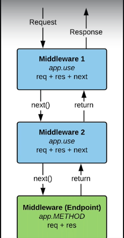
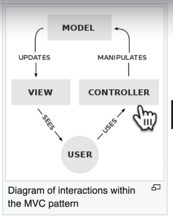

# Express API

express an backend framework package. Very similar to the build-in node `http` pattern  

- express - http://expressjs.com/
- nextjs - https://nextjs.org/
- koa - https://github.com/koajs/koa
- SSR - https://blog.logrocket.com/improve-app-performance-react-server-side-rendering/

Normally to run a script npm run [script-name]  
``` 
npm run start 
```

**Special naming**, instead of `index.js` use `server.js` when named server.js you don't need to write the script name `start` in `package.json` just running `npm run start` or `npm start` works. Since this naming is widely used to start the server

Using express `Content-Type` is automatically set depending on what is `res.send()` in.  Status Code is also automatical.  

Add extension by using `middleware`. Allow to process how `res` come and in and `res` going out. Add additional functionalities.  


Saving a `devDependencies`. Optional Packages only used for development. 
`npm install nodemon --save-dev`  

If `nodemon` is not refreshing add the `-L` flag aka --legacy-watch `nodemon -L index.js`

## Middleware
Additional functionalities 

`request --> express API --> Response`

`request --> middleware1 (req+res+next) app.use() --> middleware Endpoint (req+res) app.METHOD --> Response`



app.use() the `use()` to use middleware.  
```
app.use( (req,res,next) => {} )
```
Has a third parameter `next` in the callback. Next to call the next middleware. 

## ENDPOINTS
GET - tends to use response mostly
POST - tends to use request mostly

When sending a response to the client. Cannot send multiple res.json. Only send one, add the RETURN key to the logic. 

## MVC - Model-View-Controller design pattern


**MODEL** -> updates -> **VIEW** -> sees -> (USER) -> uses -> **CONTROLLER** -> manipulates -> MODEL 


Controller - controls how the request and response should be handle. Should use the `named function` instead of `arrow function`. 

Model - house the data


